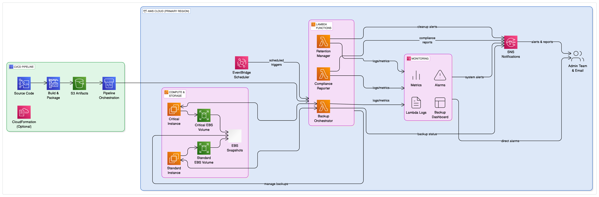

# SmartVault - Automated EC2 Backup and Compliance System

**SmartVault** is a fully automated, tag-based backup and compliance system built on AWS. It uses serverless architecture to schedule, execute, and monitor EBS snapshot backups, enforce retention policies, and generate compliance reports.

## Table of Contents

- [Project Overview](#project-overview)
- [Architecture](#architecture)
- [Features](#features)
- [AWS Services Used](#aws-services-used)
- [Lambda Functions](#lambda-functions)
- [CI/CD Deployment](#cicd-deployment)
- [Monitoring & Compliance](#monitoring--compliance)
- [Setup Guide](#setup-guide)
- [Use Cases](#use-cases)
- [License](#license)

---

## Project Overview

SmartVault enables automated backups for Amazon EC2 volumes using EBS snapshots, enforces retention based on tags, and provides reporting for compliance tracking. It is designed to reduce manual effort, lower backup storage costs, and ensure consistent disaster recovery practices.

---

## Architecture

The system is built entirely on AWS and consists of three core Lambda functions triggered by Amazon EventBridge rules. CloudWatch handles monitoring, while SNS alerts notify stakeholders of backup operations and compliance status.

A CI/CD pipeline using CodePipeline automates deployment of these Lambda functions from versioned S3 artifact storage.

The architecture diagram is available at:

`./diagrams/smartvault-architecture.txt`

Or as an image:

---

## Features

- Automated EC2 volume snapshot backups based on tag policies
- Policy-based backup frequency (daily, weekly, monthly)
- Snapshot retention enforcement (7, 30, 90, 365 days)
- Compliance reporter for non-compliant instances
- CloudWatch dashboards and alarms for visibility
- SNS alerts for backup success/failure and compliance reports
- Fully automated CI/CD pipeline with S3 artifacts

---

## AWS Services Used

- AWS Lambda
- Amazon EC2 and EBS
- Amazon EventBridge
- Amazon SNS
- Amazon CloudWatch (logs, metrics, dashboards, alarms)
- AWS IAM (custom roles and policies)
- AWS CodePipeline (with S3 and CodeBuild for CI/CD)
- Amazon S3 (versioned artifacts bucket)

---

## Lambda Functions

| Function Name        | Purpose                                                             |
|----------------------|----------------------------------------------------------------------|
| `backup-orchestrator`| Identifies EC2 instances via tag filters and creates EBS snapshots  |
| `retention-manager`  | Deletes expired snapshots based on `DeleteAfter` tag                |
| `compliance-reporter`| Checks for EC2s missing recent backups and reports compliance       |

Each function publishes metrics to CloudWatch and alerts to SNS.

---

## CI/CD Deployment

The deployment process uses AWS CodePipeline to automate updates:

1. Code is zipped and uploaded to a versioned S3 bucket.
2. CodePipeline detects the change and deploys the updated zip to Lambda.
3. No manual redeploy or edits inside the Lambda console are required.

---

## Monitoring & Compliance

- **CloudWatch Metrics**: SuccessfulBackups, FailedBackups, CompliancePercentage
- **CloudWatch Alarms**: Trigger alerts if backups fail or non-compliant EC2s are detected
- **Dashboards**: Real-time views of backup health and compliance across environments
- **SNS Notifications**: Backup success/failure, retention events, and compliance reports are sent via email or other protocols

---

## Setup Guide

1. Launch EC2 instances and apply proper backup tags:
   - `BackupPolicy`: Critical / Standard / Archive
   - `RetentionPeriod`: Number of days (e.g., 30)
   - `BackupFrequency`: Daily / Weekly / Monthly

2. Create Lambda functions using the code in:
   - `/backup-orchestrator/lambda_function.py`
   - `/retention-manager/lambda_function.py`
   - `/compliance-reporter/lambda_function.py`

3. Set up EventBridge rules to schedule each function.

4. Enable CloudWatch logging and configure metric filters and alarms.

5. Set up an SNS topic and subscribe with your email or incident management tool.

6. Use CodePipeline to deploy functions automatically from versioned S3 artifacts.

---

## Use Cases

- **Finance and Banking**: Enforce regulatory backup retention with daily snapshot creation.
- **Healthcare**: Meet HIPAA and GDPR backup retention and audit requirements.
- **Enterprise DevOps**: Apply consistent snapshot strategies across environments.
- **Managed Service Providers (MSPs)**: Offer backup-as-a-service with automated compliance reports.

---

## License

This project is open-source and available under the MIT License.

